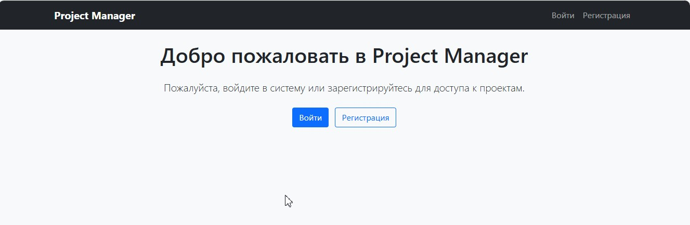
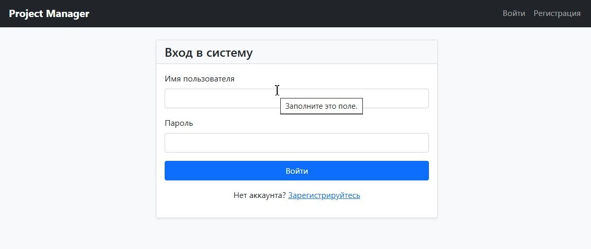
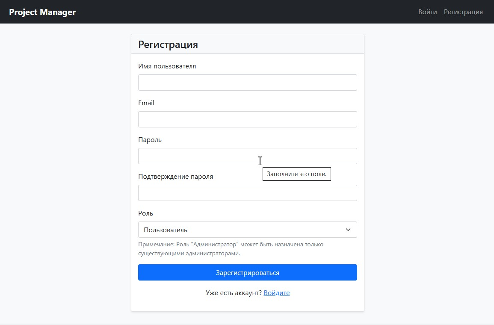
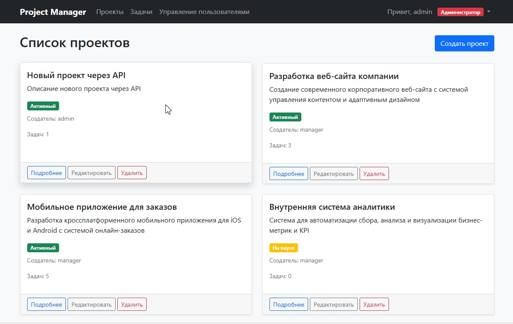
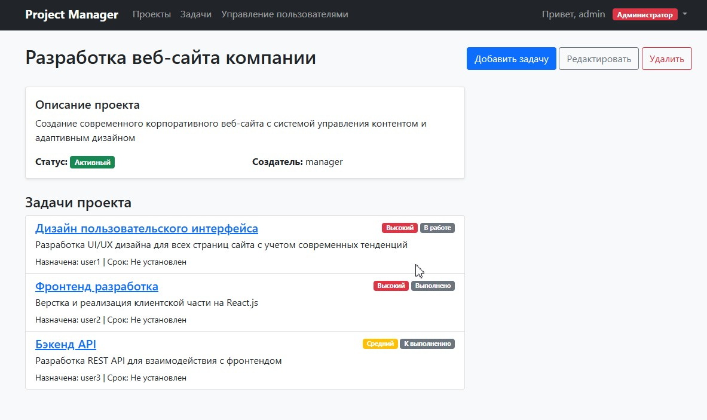
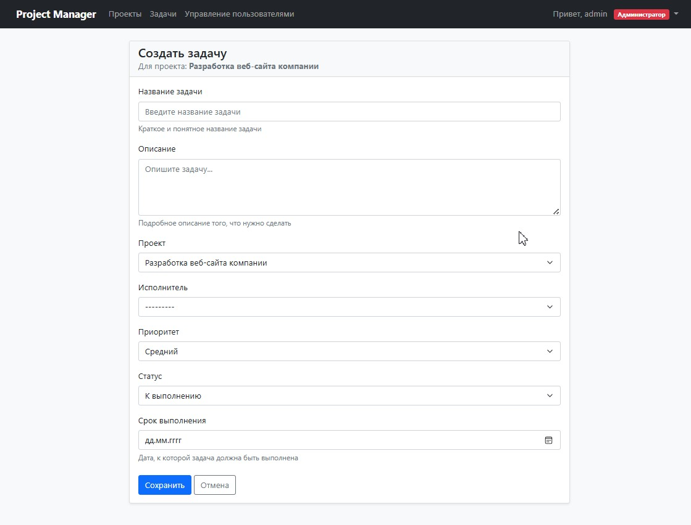
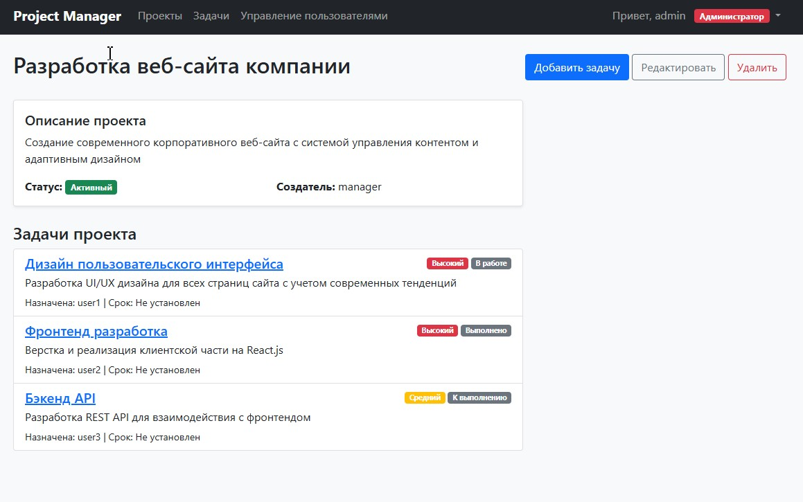
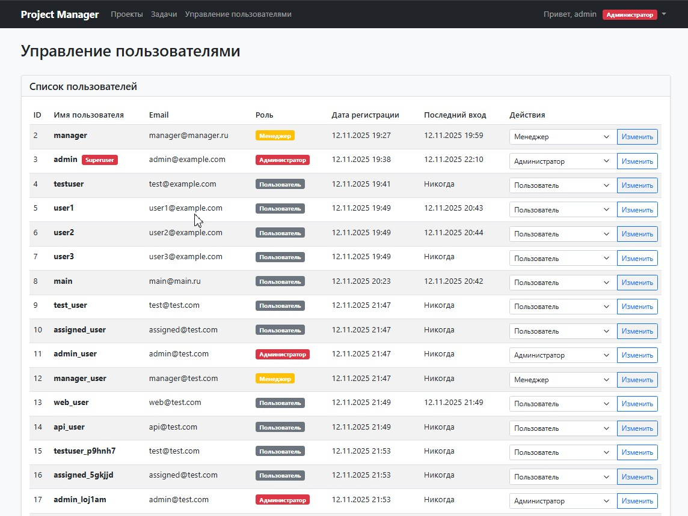
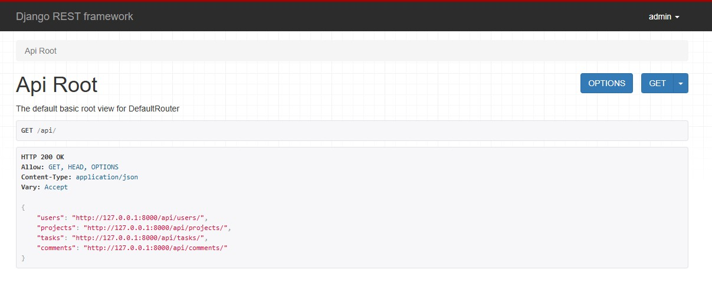

#  Project Manager- Система управления проектами с ролевым доступом
<div align="center">


[🎥 Демонстрация системы](#-демонстрация-системы)• [🚀 Быстрый старт](#-быстрый-старт)• [🎪 Демонстрация данных](#-демонстрация-данных)•[👥 Основные ролевые модели](#-основные-ролевые-модели)• [📊 Основные возможности](#-основные-возможности) • [🌐 REST API](#rest-api) • [🗂 Структура проекта](#-структура-проекта)•[🧪 Тестирование](#-тестирование)• [🎯 Соответствие требованиям задания](#-соответствие-требованиям-задания)

Полнофункциональная система управления проектами с расширенной системой аутентификации и ролевым доступом. Приложение позволяет эффективно управлять проектами, задачами и командой с четким разграничением прав доступа.


## 📸 Демонстрация системы

### Главная страница

*Приветственная страница с информацией о системе*

### Страница входа

*Форма аутентификации пользователей*

### Регистрация

*Форма регистрации нового пользователя с выбором роли*

### Список проектов

*Панель управления проектами с карточками проектов*

### Детали проекта

*Подробная информация о проекте со списком задач*

### Создание задачи

*Форма создания новой задачи с назначением исполнителя*

### Детали задачи

*Полная информация о задаче с комментариями и кнопкой завершения*

### Управление пользователями

*Панель администратора для управления пользователями и ролями*

### REST API

*Интерфейс REST API с эндпоинтами*

## 🚀 Быстрый старт
**Предварительные требования**
-Python 3.8+
-pip (менеджер пакетов Python)

**Установка и запуск**
1. Клонирование и настройка
```
bash
# Клонируйте проект
git clone <repository-url>
cd project_manager

# Создайте виртуальное окружение
python -m venv venv

# Активируйте виртуальное окружение
# Windows:
venv\Scripts\activate
# Linux/Mac:
source venv/bin/activate

# Установите зависимости
pip install -r requirements.txt

```
2. Настройка базы данных
```
bash
# Примените миграции
python manage.py migrate

# Создайте суперпользователя (опционально)
python manage.py createsuperuser

```
3. Запуск сервера
```
bash
python manage.py runserver
```
4. Доступ к приложению

- **Главная страница:** http://127.0.0.1:8000/

- **Админ-панель:** http://127.0.0.1:8000/admin/

- **REST API:** http://127.0.0.1:8000/api/

## 🎪 Демонстрация данных

**Быстрая настройка демо-данных**
```
# Создание демонстрационных пользователей и проектов
python demo_setup.py

# Просмотр возможностей системы
python demo_showcase.py

# Запускаем сервер для живой демонстрации
python manage.py runserver
```

## Демо-пользователи

После настройки демо-данных доступны:
```
Роль	Логин	Пароль	Возможности
👑 Администратор	admin_demo	admin123	Полный доступ
👔 Менеджер	manager_demo	manager123	Управление проектами
👤 Разработчик	alex_dev	user123	Завершение своих задач
🎨 Дизайнер	maria_design	user123	Завершение своих задач
🧪 Тестировщик	john_qa	user123	Завершение своих задач
```

## 👥 Основные ролевые модели

**Администратор**
- Полный доступ ко всем функциям системы
- Управление пользователями и их ролями
- Создание, редактирование, удаление проектов и задач
- Доступ ко всем данным без ограничений

**Менеджер**
- Создание и редактирование проектов
- Создание, редактирование, удаление задач
- Назначение задач пользователям
- Просмотр всех данных
- Не может: удалять проекты, управлять пользователями

**Пользователь**
- Просмотр проектов и задач
- Завершение назначенных ему задач
- Добавление комментариев к задачам
- Не может: создавать проекты и задачи, редактировать чужие задачи

## 📊 Основные возможности
### 🔐 Система аутентификации
- Регистрация пользователей с выбором роли
- Сессионная аутентификация для веб-интерфейса
- Token-аутентификация для API
- Автоматическое создание профилей пользователей

### 📋 Управление проектами
- Создание и редактирование проектов
- Назначение статусов проектам (активный, завершен, на паузе)
- Просмотр списка проектов с фильтрацией

### ✅ Управление задачами
- Создание задач в рамках проектов
- Назначение исполнителей и сроков выполнения
- Система приоритетов (низкий, средний, высокий)
- Отслеживание статусов выполнения
- Умное завершение - только исполнитель может завершить задачу

### 💬 Система комментариев
- Добавление комментариев к задачам
- История обсуждений по каждой задаче
- Временные метки и информация об авторе

## 🌐 REST API
- Полнофункциональное REST API
- Token-аутентификация
- Ролевые ограничения доступа к данным
- Пагинация и фильтрация

## 🔗 API Endpoints
**Аутентификация**
- ```POST /api/auth/register/``` - регистрация пользователя
- ```POST /api/auth/login/``` - вход в систему
- ```POST /api/auth/token/``` - получение токена аутентификации

**Основные ресурсы**
- ```GET /api/projects/``` - список проектов

- ```POST /api/projects/``` - создание проекта (manager+)

- ```GET /api/projects/{id}/``` - детали проекта

- ```PUT /api/projects/{id}/``` - обновление проекта (manager+)

- ```DELETE /api/projects/{id}/``` - удаление проекта (admin only)

- ```GET /api/tasks/``` - список задач

- ```POST /api/tasks/``` - создание задачи (manager+)

- ```GET /api/tasks/{id}/``` - детали задачи

- ```PUT /api/tasks/{id}/``` - обновление задачи

- ```POST /api/tasks/{id}/complete/``` - завершение задачи

- ```GET /api/comments/``` - список комментариев

- ```POST /api/comments/``` - создание комментария

**Примеры использования API**
```
# Регистрация пользователя
curl -X POST http://127.0.0.1:8000/api/auth/register/ \
  -H "Content-Type: application/json" \
  -d '{
    "username": "newuser",
    "email": "user@example.com",
    "password": "password123",
    "password_confirm": "password123",
    "role": "user"
  }'

# Получение списка проектов с токеном
curl -H "Authorization: Token your_token_here" \
  http://127.0.0.1:8000/api/projects/

# Создание задачи
curl -X POST http://127.0.0.1:8000/api/tasks/ \
  -H "Authorization: Token your_token_here" \
  -H "Content-Type: application/json" \
  -d '{
    "title": "Новая задача",
    "description": "Описание задачи",
    "project": 1,
    "assigned_to": 2,
    "priority": "medium"
  }'

  ```

 ## 🗂 Структура проекта
 ```
 project_manager/
├── accounts/                 # Приложение аутентификации и пользователей
│   ├── models.py            # Модели UserProfile
│   ├── views.py             # Представления регистрации, профиля
│   ├── forms.py             # Формы регистрации и редактирования
│   ├── decorators.py        # Декораторы для проверки ролей
│   └── urls.py              # URL-маршруты аутентификации
├── projects/                # Приложение проектов и задач
│   ├── models.py            # Модели Project, Task, Comment
│   ├── views.py             # Представления CRUD операций
│   ├── forms.py             # Формы проектов и задач
│   └── urls.py              # URL-маршруты проектов и задач
├── api/                     # REST API
│   ├── views.py             # API представления
│   ├── serializers.py       # Сериализаторы моделей
│   └── urls.py              # API маршруты
├── templates/               # HTML шаблоны
│   ├── base.html            # Базовый шаблон
│   ├── registration/        # Шаблоны аутентификации
│   ├── projects/            # Шаблоны проектов
│   └── tasks/               # Шаблоны задач
├── static/                  # Статические файлы
│   └── css/
│       └── style.css        # Стили Bootstrap
└── project_manager/         # Настройки проекта
    ├── settings.py          # Конфигурация Django
    └── urls.py              # Главные URL-маршруты
```
## 🧪 Тестирование 

**Запуск тестов**
```
bash
# Все тесты
python manage.py test

# Тесты конкретного приложения
python manage.py test accounts
python manage.py test projects
python manage.py test api

# Упрощенная проверка функциональности
python test_project_final.py

```
## Тестовое покрытие
- ✅ Аутентификация и роли - создание пользователей, проверка прав
- ✅ Управление проектами - CRUD операции, доступ по ролям
- ✅ Управление задачами - назначение, завершение, бизнес-логика
- ✅ REST API - эндпоинты, аутентификация, ограничения доступа
- ✅ Безопасность - проверка ролевых ограничений

## 🔧 Технологический стек
**Backend:** Django 4.2, Django REST Framework
**Frontend:** HTML5, Bootstrap 5, Jinja2 templates
**Database:** SQLite (разработка), готова к миграции на PostgreSQL
**Authentication:** Session-based + Token-based
**Additional:** SimpleJWT для токенов, Pillow для обработки изображений

## 🤝 Вклад в проект
Приветствуются contributions! Чтобы внести свой вклад:
1. Форкните репозиторий
2. Создайте feature branch (```git checkout -b feature/AmazingFeature```)
3. Закоммитьте изменения (```git commit -m 'Add some AmazingFeature'```)
4. Запушьте branch (```git push origin feature/AmazingFeature```)
5. Откройте Pull Request

## 📄 Лицензия
Этот проект распространяется под MIT License. Смотрите файл LICENSE для подробностей.

## 🎯 Соответствие требованиям задания
**✅ Выполненные требования:**
1. ✅ Регистрация и аутентификация
- Регистрация пользователей с ролями
- Сессионная аутентификация
- Ограничение доступа для неавторизованных пользователей

2. ✅ Ролевые права доступа
- Администратор - полный доступ
- Менеджер - управление проектами и задачами
- Пользователь - просмотр + завершение своих задач + комментарии

3. ✅ Доступ к ресурсам
- Декораторы @admin_required, @manager_required
- LoginRequiredMixin для защиты представлений
- Специализированные представления для разных ролей

4. ✅ Система токенов для API
- REST API с токен-аутентификацией
- Ролевые ограничения в API
- Эндпоинты для проектов, задач, комментариев, пользователей

5.✅ Тестирование доступа и логики
- Автоматические тесты созданы
- Проверка ролей и прав доступа
- Тестирование бизнес-логики

## 👥 Автор
Разработчик - BizziBerry


<div align="center">
Разработано с ❤️ на Django
⭐ Если вам понравился проект, не забудьте поставить звезду!

</div>
